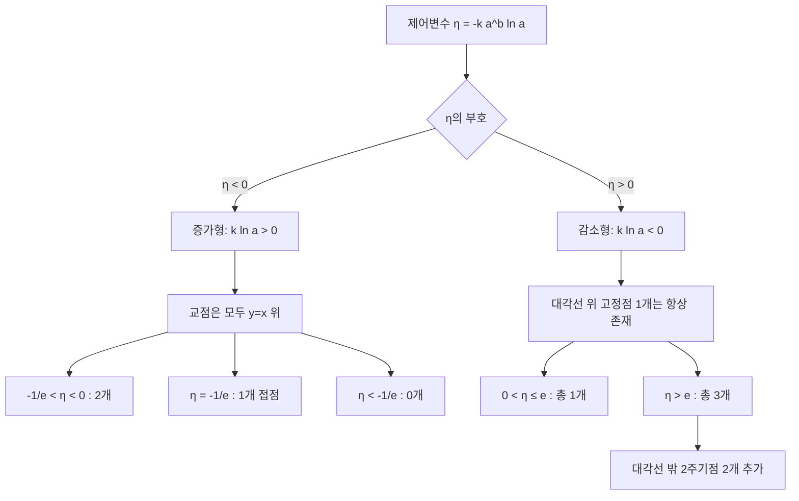

# 교점에서 Lambert W와 무한지수탑까지

## Executive Summary

이 보고서는 원래 문제
\[
y=a^x,\qquad x=a^y
\]
와 일반화된 문제
\[
f(x)=k a^x+b,\qquad \text{그 역함수의 그래프 }y=f^{-1}(x)
\]
의 교점 구조를 하나의 공통 틀로 정리한다. 핵심은 평행이동과 스케일을 정리한 뒤 등장하는 제어변수
\[
\eta:=-k a^b\ln a
\]
이다. 이 \(\eta\) 하나로 교점 개수, Lambert \(W\) 함수에 의한 대각선 위 해의 명시적 표현, 그리고 원래 문제에서 무한지수탑의 수렴 경계까지 매우 자연스럽게 연결된다. 역함수의 그래프는 \(y=x\)에 대하여 대칭이며, Lambert \(W\) 함수는 \(w\mapsto we^w\)의 역함수로 정의되는 표준 특수함수이다. 고정점의 안정성은 \(|f'(x_*)|<1\), \(|f'(x_*)|>1\)로 판정되고, 주기점은 \(f^n\)의 고정점으로 해석된다. citeturn3view3turn8search4turn10view2turn3view1

최종 분류는 다음과 같다. 원래 문제 \(y=a^x\)와 \(x=a^y\)에서는 \(0<a<e^{-e}\)이면 교점이 3개, \(e^{-e}\le a<1\)이면 1개, \(1<a<e^{1/e}\)이면 2개, \(a=e^{1/e}\)이면 접하는 1개, \(a>e^{1/e}\)이면 0개이다. 일반화된 \(f(x)=k a^x+b\)에서는 \(a>0,\ a\neq1,\ k\neq0\)일 때, \(k\ln a>0\)인 증가형은 대각선 \(y=x\) 위에서만 만나고, \(-1/e<\eta<0\)이면 2개, \(\eta=-1/e\)이면 1개, \(\eta<-1/e\)이면 0개이다. 반대로 \(k\ln a<0\)인 감소형은 대각선 위 고정점 1개를 항상 가지며, \(\eta>e\)일 때만 대각선 밖 대칭 2주기점이 추가되어 총 3개가 된다. 이때 대각선 위 해는
\[
x_*=b-\frac{1}{\ln a}W_j(\eta)
\]
로 써지며, 감소형의 임계값 \(\eta=e\)는 \(W(\eta)=1\)과 정확히 대응한다. citeturn10view2turn10view3turn8search4turn3view1

원래 문제로 되돌아가면 같은 고정점 방정식 \(x=a^x\)는 무한지수탑
\[
a^{a^{a^{\cdot^{\cdot^\cdot}}}}
\]
의 극한값 \(T\)가 만족해야 하는 식과 동일하다. 고전적 결과에 따르면 실수 양의 밑에서 무한지수탑은
\[
e^{-e}\le a\le e^{1/e}
\]
일 때 수렴하며, 그 값은
\[
T=-\frac{W(-\ln a)}{\ln a}
\]
로 쓸 수 있다. 따라서 \(e^{-e}\)는 동시에 “무한지수탑의 하한 수렴 경계”이자 “원래 교점 문제가 1개에서 3개로 갈라지는 분기점”이다. 이 연결 때문에 Lambert \(W\)와 무한지수탑은 이 문제에 억지로 붙는 부록이 아니라, 같은 고정점 방정식을 서로 다른 관점에서 본 결과다. citeturn13view0turn4view1turn4view2

## 문제 정의와 변수

이 보고서에서 기본 대상은 두 수준이다. 첫째, 원래 문제는
\[
y=a^x,\qquad x=a^y
\]
이다. 둘째, 일반화된 문제는
\[
f(x)=k a^x+b,\qquad y=f^{-1}(x)
\]
이며, 교점은
\[
y=f(x),\qquad x=f(y)
\]
를 동시에 만족하는 점으로 정의한다. 역함수 그래프는 일반적으로 \(f\)의 그래프를 직선 \(y=x\)에 대해 반사한 것이므로, 교점 문제는 곧 “함수와 그 역함수의 만남” 문제다. citeturn3view3

사용하는 변수와 가정은 다음과 같다. 사용자가 명시하지 않은 범위는 원칙적으로 **제약 없음**으로 둔다. 다만 실수 지수함수와 “역함수”라는 표현을 엄밀하게 유지하려면
\[
a>0,\quad a\neq1,\quad k\neq0
\]
가 필요하다. 여기서 \(b\)는 **제약 없음**, \(x,y\)는 기본적으로 실수 변수로 둔다. 또한 \(k>0\)이면 \(f\)의 치역이 \(x>b\) 쪽에, \(k<0\)이면 \(x<b\) 쪽에 놓이므로, 역함수의 정의역도 이에 맞추어 각각 \(x>b\), \(x<b\)가 된다. \(a=1\) 또는 \(k=0\)은 역함수 문제가 퇴화하는 특별한 경우이므로 본론에서는 제외하고, 원래 문제의 \(a=1\)만 따로 언급한다. citeturn3view3

이제 일반화된 식을 한 번에 다루기 위해
\[
X:=x-b,\qquad Y:=y-b,\qquad K:=k a^b,\qquad c:=\ln a
\]
로 두면,
\[
y=k a^x+b,\qquad x=k a^y+b
\]
는 정확히
\[
Y=K e^{cX},\qquad X=K e^{cY}
\]
로 바뀐다. 이 변환은 문제의 본질을 건드리지 않으면서 \(b\)를 없애고, 실제 분기를 일으키는 조합이 \(K\)와 \(c\)뿐임을 보여준다. 여기서 이후 전체 보고서를 관통하는 제어변수를
\[
\eta:=-cK=-k a^b\ln a
\]
로 정의한다. 이후 원래 문제와 일반화된 문제의 거의 모든 분류는 \(\eta\)의 부호와 크기로 정리된다. Lambert \(W\) 함수의 실수 가지 구조는 \([0,\infty)\)에서 하나의 실수 가지, \((-e^{-1},0)\)에서 두 개의 실수 가지를 제공하므로, 이 \(\eta\)가 곧 대각선 위 고정점의 개수를 결정한다. citeturn10view2turn10view3turn8search4

아래 표는 원래 문제와 일반화된 문제를 같은 언어로 보는 데 필요한 최소 대응표이다. 이 표는 이후 각 절의 연결 고리 역할을 한다.

| 항목 | 원래 문제 | 일반화된 문제 |
|---|---|---|
| 함수 | \(f(x)=a^x\) | \(f(x)=k a^x+b\) |
| 역함수 그래프의 식 | \(x=a^y\) | \(x=k a^y+b\) |
| 이동 후 변수 | \(X=x,\ Y=y\) | \(X=x-b,\ Y=y-b\) |
| 이동 후 계수 | \(K=1,\ c=\ln a\) | \(K=k a^b,\ c=\ln a\) |
| 제어변수 | \(\eta=-\ln a\) | \(\eta=-k a^b\ln a\) |
| 대각선 위 해 | \(x=-\dfrac{W(-\ln a)}{\ln a}\) | \(x=b-\dfrac{1}{\ln a}W(\eta)\) |
| 핵심 동역학 의미 | 고정점과 2주기점 | 고정점과 2주기점 |

## 원래 문제의 완전 분류

원래 문제는 일반화된 문제에 \(k=1,\ b=0\)을 대입한 특수한 경우이며, 제어변수는
\[
\eta=-\ln a
\]
로 단순해진다. 따라서 \(0<a<1\)이면 \(\eta>0\), \(a>1\)이면 \(\eta<0\)이고, 이 부호 전환이 곧 감소형과 증가형을 가르는 분기점이다. 이 관점은 뒤의 일반화에서도 그대로 유지된다. citeturn8search4turn10view2turn10view3

먼저 교점을 두 종류로 나눈다. 교점 \((x,y)\)가
\[
y=a^x,\qquad x=a^y
\]
를 만족하면, \(x=y\)인 점은 대각선 \(y=x\) 위의 **고정점**이고, \(x\neq y\)인 점은 \(f(x)=a^x\)에 대한 **2주기점**이다. 실제로
\[
x=a^y=a^{a^x}=f(f(x))
\]
이므로 교점은 \(f^2(x)=x\)의 해이며, 그중 \(f(x)=x\)는 고정점, \(f(x)\neq x\)는 진짜 2주기점이다. 또한 역함수 그래프와의 만남이므로, 대각선 밖 교점은 항상 \((x,y)\)와 \((y,x)\)의 쌍으로 나타난다. 주기점은 \(f^n\)의 고정점이며, 주기의 안정성은 \((f^n)'\)로 판정한다. citeturn3view3turn3view1

대각선 위 고정점은
\[
x=a^x
\]
를 푸는 문제로 바뀐다. 이를 Lambert \(W\) 함수로 정리하면
\[
x=a^x
\iff x e^{-x\ln a}=1
\iff (-x\ln a)e^{-x\ln a}=-\ln a
\iff -x\ln a=W(-\ln a),
\]
따라서
\[
x=-\frac{W(-\ln a)}{\ln a}.
\]
여기서 \(a>1\)이면 \(-\ln a\in(-\infty,0)\)이고, 실수 해의 수는 Lambert \(W\)의 실수 가지 수에 의해 결정된다. DLMF에 따르면 \((-e^{-1},0)\)에서는 두 개의 실수 가지 \(W_0, W_{-1}\)가 존재하고, \([0,\infty)\)에서는 주가지 \(W_0\) 하나만 존재한다. citeturn8search4turn10view2turn10view3

이제 \(a>1\)인 증가형부터 본다. \(f(x)=a^x\)는 증가함수이므로, 만약 어떤 교점에서 \(x<y\)라면 증가성 때문에
\[
f(x)<f(y)
\]
여야 한다. 그러나 교점 조건에서는 \(f(x)=y,\ f(y)=x\)이므로
\[
y<x
\]
가 되어 모순이다. 따라서 증가형에서는 대각선 밖 교점이 없고, 교점은 모두 \(y=x\) 위에만 놓인다. 결국 교점 개수는 \(x=a^x\)의 실근 개수와 같다. 이것을 위의 Lambert \(W\) 식으로 옮기면
\[
-1/e<-\ln a<0 \iff 1<a<e^{1/e}
\]
일 때 2개,
\[
-\ln a=-1/e \iff a=e^{1/e}
\]
일 때 접하는 1개,
\[
-\ln a<-1/e \iff a>e^{1/e}
\]
일 때 0개가 된다. 증가형에서 Lambert \(W\)는 단순히 해를 “표현”하는 수준을 넘어서, 개수 분류까지 직접 담당한다. citeturn10view2turn10view3turn13view0

반대로 \(0<a<1\)이면 \(f(x)=a^x\)는 감소함수이므로, 교점은 대각선 위 고정점 1개에 더해 대각선 밖 대칭쌍이 생길 가능성이 있다. 이 구간에서는 \(\eta=-\ln a>0\)이고, 주가지 \(W_0(\eta)\)가 항상 실수이므로 대각선 위 해는 항상 하나 존재한다. 문제는 그 외에 2주기점이 생기느냐이다. 이를 위해
\[
u:=(-\ln a)x,\qquad v:=(-\ln a)y,\qquad \lambda:=\eta=-\ln a>0
\]
로 두면
\[
v=\lambda e^{-u},\qquad u=\lambda e^{-v}
\]
가 된다. 다시 합성하면
\[
u=\lambda e^{-\lambda e^{-u}}.
\]
따라서
\[
H_\lambda(u):=\lambda e^{-\lambda e^{-u}}-u
\]
의 근 개수를 세면 된다. citeturn3view1turn8search4

여기서 미분을 한 단계도 건너뛰지 않고 계산하면,
\[
H'_\lambda(u)=\lambda^2 e^{-u-\lambda e^{-u}}-1.
\]
이제
\[
s:=\lambda e^{-u}>0
\]
로 두면
\[
H'_\lambda(u)=\lambda s e^{-s}-1.
\]
그런데 \(s e^{-s}\)의 최댓값은 \(s=1\)에서 \(1/e\)이므로
\[
H'_\lambda(u)\le \frac{\lambda}{e}-1.
\]
따라서
\[
\lambda\le e
\]
이면 \(H'_\lambda(u)\le0\)가 모든 \(u\)에서 성립하므로 \(H_\lambda\)는 단조감소이고 근은 정확히 1개다. 반대로
\[
\lambda>e
\]
이면 \(H'_\lambda\)가 어떤 구간에서 양수가 되므로 \(H_\lambda\)는 음함수-양함수-음함수 형태를 가지며, 기존 고정점 근을 가운데에 두고 추가 근 2개가 생긴다. 즉
\[
0<a<e^{-e}
\]
일 때만 대각선 밖 2주기점 2개가 추가되어 총 3개의 교점이 생긴다. 이것이 원래 문제에서 자주 묻는 “3개의 교점 조건”의 엄밀한 유도다. 안정성 기준 \(|f'(x_*)|<1\), \(|f'(x_*)|>1\)은 이 분기와 정확히 일치한다. citeturn3view1turn13view0

그림은 \(a=0.05\)일 때의 교점 구조를 보여준다. 이 경우
\[
-\ln(0.05)\approx 2.995732>e
\]
이므로 이론상 총 3개의 교점이 존재해야 하고, 실제 수치해는
\[
(0.137359\ldots,\,0.662661\ldots),\quad
(0.350225\ldots,\,0.350225\ldots),\quad
(0.662661\ldots,\,0.137359\ldots)
\]
로 나타난다. 그림은 본 보고서가 해당 식을 직접 수치적으로 그린 것이다. citeturn3view3turn3view1turn13view0

원래 문제 전체를 한 표로 요약하면 다음과 같다. 이 표를 보면, 이후 일반화에서도 사실상 “\(\eta=-\ln a\)를 \(\eta=-k a^b\ln a\)로 바꾸기만 하면 된다”는 점이 분명해진다.

| \(a\)의 범위 | \(\eta=-\ln a\) | 교점 개수 | 구조 |
|---|---:|---:|---|
| \(0<a<e^{-e}\) | \(\eta>e\) | 3 | 대각선 위 1개 + 대각선 밖 2개 |
| \(e^{-e}\le a<1\) | \(0<\eta\le e\) | 1 | 대각선 위 1개 |
| \(a=1\) | \(\eta=0\) | 1 | 퇴화한 경우 \((1,1)\) |
| \(1<a<e^{1/e}\) | \(-1/e<\eta<0\) | 2 | 대각선 위 2개 |
| \(a=e^{1/e}\) | \(\eta=-1/e\) | 1 | 대각선 위 접점 1개 |
| \(a>e^{1/e}\) | \(\eta<-1/e\) | 0 | 실수 교점 없음 |

## 일반화된 문제의 완전 분류

이제
\[
f(x)=k a^x+b
\]
와 그 역함수의 교점으로 옮겨가도, 실제 구조는 앞 절에서 이미 거의 준비되어 있다. \(X=x-b,\ Y=y-b,\ K=k a^b,\ c=\ln a\)를 두면
\[
Y=K e^{cX},\qquad X=K e^{cY}
\]
가 되었고, 제어변수는
\[
\eta=-cK=-k a^b\ln a
\]
였다. 따라서 원래 문제와 일반화된 문제의 차이는 ‘밑 \(a\) 하나’가 아니라 ‘정규화된 하나의 실수 매개변수 \(\eta\)’로 압축된다. 이 점이 발표 구성에서 연결성을 만드는 가장 좋은 축이다. citeturn8search4turn10view2turn10view3

먼저 대각선 위 해를 정리한다. \(x=y\), 즉 \(X=Y\)이면
\[
X=K e^{cX}.
\]
이를 단계별로 Lambert \(W\) 꼴로 바꾸면
\[
X e^{-cX}=K,
\]
\[
(-cX)e^{-cX}=-cK=\eta,
\]
\[
-cX=W_j(\eta).
\]
따라서 모든 대각선 위 교점은
\[
x_*=b-\frac{1}{\ln a}W_j(\eta)
\]
로 주어진다. 여기서 \(j\)는 허용되는 실수 가지를 뜻한다. 즉 \(\eta>0\)이면 \(W_0\)만, \(-1/e\le\eta<0\)이면 \(W_0\)와 \(W_{-1}\) 두 가지가 가능하다. 이 한 식이 원래 문제와 일반화된 문제를 동시에 설명한다. citeturn8search4turn10view2turn10view3

이제 증가형과 감소형을 나눈다. \(f'(x)=k\ln(a)a^x\)이므로
\[
k\ln a>0
\]
이면 증가형, 
\[
k\ln a<0
\]
이면 감소형이다. 증가형에서는 앞 절과 같은 단조성 논법이 그대로 작동하므로, 교점은 모두 대각선 \(y=x\) 위에만 있다. 따라서 개수는 Lambert \(W\)의 실수 가지 수로 끝난다. 증가형에서는 \(\eta<0\)이므로

\[
-1/e<\eta<0
\quad\Longleftrightarrow\quad
0<k a^b\ln a<1/e
\]
일 때 2개,
\[
\eta=-1/e
\quad\Longleftrightarrow\quad
k a^b\ln a=1/e
\]
일 때 접하는 1개,
\[
\eta<-1/e
\quad\Longleftrightarrow\quad
k a^b\ln a>1/e
\]
일 때 0개다. 증가형에서는 “역함수와의 교점” 문제가 사실상 “\(W_0\)와 \(W_{-1}\) 두 실수 가지가 살아 있느냐”의 문제로 귀결된다. citeturn10view2turn10view3turn8search4

감소형에서는 이야기가 한 단계 더 나아간다. \(X\)와 \(Y\)는 같은 부호를 가지므로
\[
U:=|X|,\qquad V:=|Y|,\qquad C:=|K|=|k|a^b,\qquad \gamma:=|c|=|\ln a|
\]
로 두면, 부호 정보는 사라지고 항상 같은 정규형
\[
V=C e^{-\gamma U},\qquad U=C e^{-\gamma V}
\]
를 얻는다. 여기에
\[
u:=\gamma U,\qquad v:=\gamma V,\qquad \lambda:=\gamma C=|k|a^b|\ln a|=\eta>0
\]
를 정의하면
\[
v=\lambda e^{-u},\qquad u=\lambda e^{-v}
\]
가 되고, 결국 앞 절과 완전히 동일한 \(H_\lambda\) 분석으로 돌아간다. 그래서 감소형의 완전한 분류는
\[
k\ln a<0,\qquad |k|a^b|\ln a|>e
\]
일 때 총 3개,
\[
k\ln a<0,\qquad |k|a^b|\ln a|\le e
\]
일 때 총 1개가 된다. 이 식이 일반화된 문제에서 사용해야 하는 가장 명확한 “3교점 조건”이다. citeturn3view1turn13view0

위 그림은
\[
H_\lambda(u)=\lambda e^{-\lambda e^{-u}}-u
\]
의 근 구조가 \(\lambda=e\)에서 어떻게 바뀌는지를 보여준다. \(\lambda<e\)에서는 근이 하나뿐이지만, \(\lambda>e\)가 되면 가운데 고정점 근을 사이에 두고 양옆에 근 둘이 더 생겨 총 3개가 된다. 이 그림은 본 보고서가 위 정규형을 직접 그린 것이다. citeturn3view1turn13view0

일반화된 문제의 최종 요약은 다음 표 하나로 끝난다.

| 조건 | \(\eta=-k a^b\ln a\) | 교점 개수 | 구조 |
|---|---:|---:|---|
| \(k\ln a>0\) 증가형, \(-1/e<\eta<0\) | \(-1/e<\eta<0\) | 2 | 모두 \(y=x\) 위 |
| \(k\ln a>0\) 증가형, \(\eta=-1/e\) | \(-1/e\) | 1 | \(y=x\) 위 접점 |
| \(k\ln a>0\) 증가형, \(\eta<-1/e\) | \(<-1/e\) | 0 | 실수 교점 없음 |
| \(k\ln a<0\) 감소형, \(0<\eta\le e\) | \(0<\eta\le e\) | 1 | \(y=x\) 위 고정점 |
| \(k\ln a<0\) 감소형, \(\eta>e\) | \(>e\) | 3 | \(y=x\) 위 1개 + 대칭 2주기점 2개 |

## Lambert W로 이어지는 해석

여기서 Lambert \(W\) 함수는 단순한 계산 보조가 아니라, 대각선 위 구조를 가장 압축적으로 표현하는 언어가 된다. Corless 등은 Lambert \(W\)를 \(w\mapsto we^w\)의 다가 역함수로 정의했고, DLMF는 실수축에서 \([0,\infty)\)에는 하나의 실수 가지, \((-e^{-1},0)\)에는 두 개의 실수 가지가 존재함을 정리한다. 이 실수 가지 구조 자체가 곧 교점 개수 구조로 번역된다. citeturn8search4turn10view2turn10view3

더 중요한 것은 **안정성까지 Lambert \(W\)로 써진다**는 점이다. 대각선 위 고정점 \(x_*\)에서 \(X_*=x_*-b\)라고 하면
\[
f'(x_*)=k\ln a\,a^{x_*}=cK e^{cX_*}=cX_*.
\]
그런데 앞서
\[
-cX_*=W_j(\eta)
\]
였으므로,
\[
f'(x_*)=-W_j(\eta)
\]
가 된다. 즉 고정점의 안정성은 \(|W_j(\eta)|\) 하나로 결정된다. \(|f'(x_*)|<1\)이면 attracting, \(|f'(x_*)|>1\)이면 repelling이라는 표준 1차원 동역학 판정법을 대입하면, 증가형에서 \(W_0\)가 주는 작은 고정점은 보통 안정적이고 \(W_{-1}\)가 주는 큰 고정점은 불안정하다는 사실이 즉시 나온다. 감소형에서는 오직 주가지 \(W_0(\eta)\)만 실수이고, 이 값이 1을 넘는 순간 대각선 밖 2주기점이 나타난다. citeturn3view1turn8search4

이제 왜 임계값이 \(e\)인지도 짧게 설명된다. 감소형에서
\[
|f'(x_*)|=|W_0(\eta)|.
\]
실수 양수 구간에서 \(W_0\)는 증가하므로
\[
|f'(x_*)|=1
\iff W_0(\eta)=1
\iff \eta=e.
\]
즉 “임계값 \(\eta=e\)”는 특별한 상수가 갑자기 튀어나온 것이 아니라, Lambert \(W\)가 정확히 1을 지나는 지점이다. 원래 문제의 \(0<a<e^{-e}\)도 바로 \(\eta=-\ln a>e\)를 되돌린 결과다. citeturn10view2turn8search4turn3view1

반대로 증가형의 임계값 \(\eta=-1/e\)는 두 실수 가지 \(W_0,\ W_{-1}\)가 합쳐지는 지점이다. 따라서
\[
\eta=-1/e
\]
는 “대각선 위의 두 교점이 하나의 접점으로 합쳐지는” 경계이고,
\[
\eta=e
\]
는 “대각선 위 고정점 하나에서 대각선 밖 2주기점 둘이 갈라져 나오는” 경계다. 이 두 현상은 완전히 다른 모양을 보이지만, 사실상 모두 Lambert \(W\) 가지 구조와 안정성 \(|W(\eta)|=1\)에서 나온다. 이런 의미에서 Lambert \(W\)는 이 문제와 **명확한 상관이 있다**. 다만 엄밀히 말해, Lambert \(W\)가 모든 교점을 닫힌형으로 직접 주는 것은 아니고, 특히 대각선 밖 2주기점은 대체로 수치적으로 구해야 한다. Lambert \(W\)의 직접적인 역할은 대각선 위 해와 임계값을 정밀하게 언어화하는 데 있다. citeturn8search4turn10view2turn10view3turn3view1

## 무한지수탑으로 이어지는 해석

이제 발표를 한 단계 더 확장하는 연결고리는 아주 짧다. 원래 문제에서 대각선 위 고정점은
\[
x=a^x
\]
를 만족했다. 그런데 무한지수탑
\[
T=a^{a^{a^{\cdot^{\cdot^\cdot}}}}
\]
이 실수로 수렴한다면, 위쪽 꼬리도 다시 \(T\)여야 하므로
\[
T=a^T
\]
를 만족한다. 즉 원래 문제의 대각선 위 교점 방정식과 무한지수탑의 극한 방정식은 완전히 동일하다. 바로 이 한 줄 때문에, 교점 문제에서 Lambert \(W\)와 무한지수탑으로 넘어가는 흐름은 억지 확장이 아니라 같은 고정점 방정식의 재해석이 된다. citeturn13view0turn4view3

MathWorld는 실수 양의 밑의 무한지수탑 \(h(z)=z^{z^{z^\cdot}}\)에 대해
\[
h(z)= -\frac{W(-\ln z)}{\ln z}
\]
이고, 실수 수렴은 정확히
\[
e^{-e}\le z\le e^{1/e}
\]
일 때 일어난다고 정리한다. Wikipedia의 정리도 같은 구간을 제시하며, 이 극한이 존재하면 \(y=x^y\), 즉 \(x=y^{1/y}\)의 해가 된다고 설명한다. 따라서 원래 문제의 대각선 위 고정점은 무한지수탑의 후보값일 뿐 아니라, 실제 수렴 구간 안에서는 바로 그 극한값이 된다. citeturn13view0turn4view1turn4view2

이때 안정성 해석이 교점 분류와 완전히 맞물린다. \(f(x)=a^x\)의 고정점 \(T\)에서
\[
f'(T)=T\ln a.
\]
또한
\[
-T\ln a=W(-\ln a)
\]
이므로,
\[
|f'(T)|=|T\ln a|
\]
의 크기는 Lambert \(W\) 값으로 바로 정리된다. \(0<a<1\)의 감소형에서는 \(|f'(T)|=W(-\ln a)\)이고, 이것이 1을 넘는 순간이 정확히 \(a=e^{-e}\)이다. 따라서 \(a<e^{-e}\)에서는 고정점이 불안정해지고 대각선 밖 2주기점이 나타난다. 다시 말해, “무한지수탑이 더 이상 한 값으로 수렴하지 않는 하한 경계”와 “교점 개수가 1개에서 3개로 바뀌는 경계”가 정확히 같은 \(e^{-e}\)에 놓인다. citeturn3view1turn13view0turn8search4

증가형 \(1<a<e^{1/e}\)에서는 두 고정점이 존재하지만, 표준 무한지수탑 반복
\[
x_{n+1}=a^{x_n},\qquad x_0=1
\]
은 안정적인 작은 고정점으로 간다. 큰 고정점은 \(|f'|>1\)이라 불안정하다. 다만 끝점 \(a=e^{-e}\)와 \(a=e^{1/e}\)에서는 \(|f'|=1\)이므로 지역적 도함수 판정만으로는 결론이 나지 않지만, 고전 문헌과 MathWorld의 정리에서는 이 두 끝점도 포함한 닫힌 구간 \([e^{-e},e^{1/e}]\) 전체가 수렴 구간으로 제시된다. 따라서 발표에서는 “개방구간에서는 안정성 판정이 직접적이고, 끝점 포함 여부는 고전적 수렴 정리로 보완된다”라고 말하는 것이 가장 정확하다. citeturn3view1turn13view0turn4view1

한 문장으로 정리하면 이렇다. **Lambert \(W\)는 대각선 위 해를 명시적으로 쓰게 해 주고, 무한지수탑은 그 같은 해를 반복동역학의 극한으로 해석하게 해 준다.** 그래서 발표 흐름은 “교점 \(\to\) 고정점 \(\to\) Lambert \(W\) \(\to\) 반복 \(\to\) 무한지수탑”으로 자연스럽게 연결된다. citeturn8search4turn13view0

## 예제와 시각자료

이 절의 수치 예제는 앞서 도출한 공식
\[
x_*=b-\frac{1}{\ln a}W_j(\eta),\qquad \eta=-k a^b\ln a
\]
와, 대각선 밖 교점에 대해서는 \(f(f(x))=x\)의 수치해를 그대로 사용해 계산했다. 무한지수탑 판정은 원래 문제 \(k=1,b=0\)에 대해서만 표준적으로 적용했고, 일반화된 문제는 엄밀히 말해 “tetration”이 아니라 \(f\)의 반복동역학으로 해석했다. citeturn8search4turn13view0turn3view1

| 예시 | 계산 | 교점 좌표 | Lambert \(W\) 사용 | 반복/무한지수탑 판정 |
|---|---|---|---|---|
| 원래 문제 \(a=0.05\) | \(\eta=-\ln 0.05=2.995732>e\) | \((0.137359,0.662661)\), \((0.350225,0.350225)\), \((0.662661,0.137359)\) | 대각선 위 점은 \(x_*=\dfrac{W(2.995732)}{2.995732}=0.350225\) | 표준 무한지수탑은 수렴하지 않음. 반복 \(x_{n+1}=0.05^{x_n}\)는 2주기쌍으로 접근 |
| 원래 문제 \(a=1.2\) | \(\eta=-\ln 1.2=-0.182322\in(-1/e,0)\) | \((1.257735,1.257735)\), \((14.767458,14.767458)\) | \(x_1=-\dfrac{W_0(-0.182322)}{\ln1.2}\), \(x_2=-\dfrac{W_{-1}(-0.182322)}{\ln1.2}\) | 표준 무한지수탑은 수렴하며, \(x_0=1\)에서 시작하면 작은 고정점 \(1.257735\)로 감 |
| 일반화 \(a=\tfrac12,\ k=4,\ b=0\) | \(\eta=-4\ln(\tfrac12)=4\ln2=2.772589>e\) | \((1,2)\), \((1.4569996,1.4569996)\), \((2,1)\) | 대각선 위 점은 \(x_*=-\dfrac{W(4\ln2)}{\ln(1/2)}=1.4569996\) | 표준 무한지수탑 직접 적용 아님. 대신 \(x_{n+1}=4(1/2)^{x_n}\)는 2주기 \((1,2)\)로 천천히 접근 |
| 일반화 \(a=2,\ k=-1,\ b=1\) | \(\eta=-(-1)\cdot 2^1\ln2=2\ln2=1.386294<e\) | \((0,0)\) 한 점 | \(x_*=1-\dfrac{W(2\ln2)}{\ln2}=1-\dfrac{\ln2}{\ln2}=0\) | 표준 무한지수탑 직접 적용 아님. 대신 \(x_{n+1}=1-2^{x_n}\)는 고정점 0으로 수렴 |

원래 문제 \(a=0.05\)의 반복을 몇 단계 적어 보면
\[
x_0=1,\quad x_1=0.05,\quad x_2\approx0.86089166,\quad x_3\approx0.07584975,\quad x_4\approx0.79674107,\dots
\]
로 짝수항과 홀수항이 서로 다른 값으로 진동한다. 더 많이 반복하면 짝수항은 \(0.6626608389\ldots\), 홀수항은 \(0.1373593957\ldots\)로 접근한다. 이것은 “무한지수탑이 하나의 값으로 수렴하지 않는다”는 사실과 “교점이 3개라서 2주기점이 존재한다”는 사실이 같은 동역학 현상의 두 표현임을 보여준다. citeturn13view0turn3view1

원래 문제 \(a=1.2\)에서는 상황이 다르다. 표준 반복
\[
x_{n+1}=1.2^{x_n},\qquad x_0=1
\]
을 계산하면
\[
1,\ 1.2,\ 1.244564747,\ 1.254718171,\ 1.257043041,\ 1.257575982,\dots
\]
로 안정적인 작은 고정점 \(1.257734541\ldots\)로 수렴한다. 큰 고정점 \(14.767458381\ldots\)도 같은 방정식의 해이지만, 이는 \(W_{-1}\) 가지가 주는 불안정한 해다. 이 예시는 Lambert \(W\) 두 실수 가지가 실제로는 “두 개의 실근”만이 아니라 “안정한 해와 불안정한 해”의 분리까지 담고 있음을 보여준다. citeturn8search4turn10view2turn10view3turn3view1

일반화된 예시 \(y=4\cdot 0.5^x\)는 발표용으로 특히 좋다. 왜냐하면 대각선 밖 2주기점이
\[
(1,2),\qquad (2,1)
\]
처럼 정확한 정수쌍으로 잡히기 때문이다. 실제로
\[
4\cdot 0.5^1=2,\qquad 4\cdot 0.5^2=1
\]
이므로 두 점은 곧바로 확인된다. 그리고 대각선 위의 세 번째 교점은 Lambert \(W\) 한 번으로
\[
x_*=-\frac{W(4\ln2)}{\ln(1/2)}\approx1.456999559
\]
라고 쓸 수 있다. 이 한 예시만으로 “대각선 위 해는 \(W\), 대각선 밖 해는 2주기, 임계조건은 \(\eta>e\)”라는 보고서의 핵심을 거의 모두 설명할 수 있다. citeturn8search4turn3view1

그림은 일반화된 예시 \(y=4\cdot 0.5^x\)와 그 역함수 \(y=\log_{0.5}(x/4)\)의 교점 구조를 보여준다. 대각선 밖의 두 점 \((1,2)\), \((2,1)\)과 대각선 위의 고정점 \((1.456999\ldots,1.456999\ldots)\)이 동시에 나타난다. 그림은 본 보고서가 직접 그린 수치도다. citeturn3view3turn3view1turn8search4

교점 수 변화는 아래 흐름도로 압축할 수 있다. 발표에서 한 장짜리 요약 슬라이드로 쓰기 좋다.

## 발표용 정리와 참고문헌

발표 슬라이드용으로 압축하면, 다음 여섯 문장이 핵심 메시지다.

- \(y=a^x\)와 \(x=a^y\)의 교점 문제는 함수 \(f(x)=a^x\)와 그 역함수의 교점 문제이며, 교점은 곧 \(f^2(x)=x\)의 해다. citeturn3view3turn3view1
- 대각선 \(y=x\) 위의 교점은 고정점 \(f(x)=x\), 대각선 밖 교점은 진짜 2주기점이다. citeturn3view1
- 일반화된 \(f(x)=k a^x+b\)도 \(X=x-b\), \(K=k a^b\), \(\eta=-k a^b\ln a\)로 정리하면 같은 구조로 환원된다. citeturn8search4
- 증가형 \(k\ln a>0\)에서는 교점이 모두 대각선 위에만 있고, 감소형 \(k\ln a<0\)에서만 대각선 밖 2주기점이 생길 수 있다. citeturn3view3turn3view1
- 대각선 위 교점은 \(x_*=b-\dfrac{1}{\ln a}W_j(\eta)\)로 표현되므로, Lambert \(W\)는 이 문제의 자연스러운 해석 도구다. citeturn8search4turn10view2turn10view3
- 원래 문제에서는 같은 고정점 방정식 \(x=a^x\)가 무한지수탑의 극한 방정식이므로, \(e^{-e}\)는 동시에 3교점 분기점이자 무한지수탑 수렴의 하한 경계다. citeturn13view0turn4view1turn4view2

권장 발표 흐름도 이 연결성에 맞추는 것이 가장 자연스럽다. 먼저 원래 문제의 그래프를 보여 주고 “대각선 위 고정점 vs 대각선 밖 2주기점”이라는 분류를 소개한다. 다음으로 \(a<1\)과 \(a>1\)을 나누어 교점 개수를 완전히 분류한다. 그 뒤 \(X=x-b,\ Y=y-b\) 변환과 \(\eta=-k a^b\ln a\)를 도입해 일반화된 문제를 같은 틀로 통합한다. 그 다음 대각선 위 해를 Lambert \(W\)로 명시하고, \(f'(x_*)=-W(\eta)\)라는 식으로 임계값 \(\eta=e\), \(\eta=-1/e\)를 설명한다. 마지막으로 원래 문제로 돌아와 \(x=a^x\)가 곧 무한지수탑의 극한 방정식이라는 점을 보여 주면, 보고서 전체가 한 줄의 고정점 방정식으로 닫힌다. 이 배열이 가장 덜 끊기고, 파트가 바뀔 때마다 “같은 식을 다른 시점에서 다시 본다”는 느낌을 준다. citeturn8search4turn13view0turn3view1

결론만 다시 쓰면 다음과 같다. 원래 문제에서 3개의 교점 조건은
\[
0<a<e^{-e}
\]
이고, 일반화된 문제에서 3개의 교점 조건은
\[
k\ln a<0,\qquad |k|a^b|\ln a|>e
\]
이다. Lambert \(W\) 함수는 대각선 위 고정점을 명시적으로 표현하고 임계값을 해석하게 해 주며, 무한지수탑은 같은 고정점 방정식을 반복동역학의 극한으로 재해석하게 해 준다. 따라서 이 보고서의 세 주제 — 교점, Lambert \(W\), 무한지수탑 — 는 서로 다른 장식이 아니라 하나의 동일한 구조에서 나온다. citeturn8search4turn10view2turn10view3turn13view0turn3view1

참고한 핵심 문헌은 다음과 같다.

- Corless, Gonnet, Hare, Jeffrey, Knuth, “On the Lambert W Function,” *Advances in Computational Mathematics* 5, 1996. Lambert \(W\)의 표준 참고문헌이다. citeturn8search4turn8search0
- NIST DLMF, §4.13 “Lambert W-Function.” 실수 가지의 존재 구간과 가지 구조를 확인하는 데 사용했다. citeturn3view4turn10view2turn10view3
- Wolfram MathWorld, “Inverse Function.” 함수와 역함수의 그래프가 \(y=x\)에 대해 대칭이라는 점을 사용했다. citeturn3view3
- UBC Dynamical Systems notes, “3 Fixed points — summary.” 고정점의 attracting/repelling 기준과 주기점에서의 연쇄법칙을 사용했다. citeturn3view1turn6view0turn6view1
- Wolfram MathWorld, “Power Tower.” 무한지수탑의 Lambert \(W\) 표현식과 수렴 구간 \([e^{-e},e^{1/e}]\)을 사용했다. citeturn13view0
- English Wikipedia, “Tetration.” 무한지수탑을 \(y\mapsto y^{1/y}\)의 역함수로 보는 설명과 고전적 수렴 구간 진술을 보조적으로 확인했다. citeturn4view1turn4view2turn4view3